# 관통 프로젝트


<h4>✔ 목적 : 영화 추천사이트</h4>

#### ✔ 프로젝트 기간 : 21.11.17(수) ~ 21.11.25(목)

#### ✔ 팀원 : 박예정, 이현석


## 1. 목표

- 영화 정보 기반 추천 서비스 구성
- 커뮤니티 서비스 구성
- HTML, CSS, JavaScript, Vue.js, Django, REST API, DataBase 등을 활용한 실제 서비스 설계
- 서비스 관리 및 유지보수


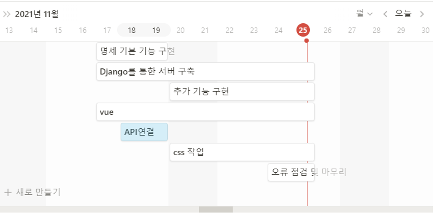


## 2. 준비사항

1. 언어 

- Python 3.8+

- Django 3.X

- Node LTS

- Vue.js 2.+

  

2. 도구

- Visual Studio Code
- Chrome Browser
- Postman


3. 아키텍처

- Django & Vanila JS
- Django REST API 서버 & Vue.js


## 3. 팀원 정보 및 업무 분담 내역

박예정

```
- vue를 활용해 전반적인 사이트 기능 구현
- UI/UX 향상을 위한 CSS 구현
- 서버 측 오류 수정
```


이현석

```
- django를 통해 DB 모델링 및 최적화
- 영화 추천 알고리즘 구현
- json 가공을 통한 데이터 처리
- UI/UX 향상을 위한 CSS 구현
```


## 4. 목표 서비스 구현 및 실제 구현 정도

✔ 목표 대비 실제 구현 정도 : 80% 

홈페이지 기능면에서 목표했던 부분은 모두 구현했다!

(홈, 영화 상세페이지, 커뮤니티, 평점, 검색, 계정 등)


하지만 Home.vue에서 영화 정보를 무한 스크롤 방식으로 받아 오는 것과

스크롤을 내리면 Navigation Bar가 fixed 되면서 투명한 색에서 검정색으로 변하는 기능을

추가하고 싶었는데 부족한 시간과 능력으로 구현하지 못했다.


예쁜 CSS 효과가 많았는데 시간이 부족하고 지식이 부족해서 구현하지 못한것이 아쉬웠다.

알고리즘도 원하는건 확실한데 내가 부족해서 원하는대로 구현하지 못한 것 같아 아쉬웠다.


## 5. 데이터베이스 모델링 (ERD)

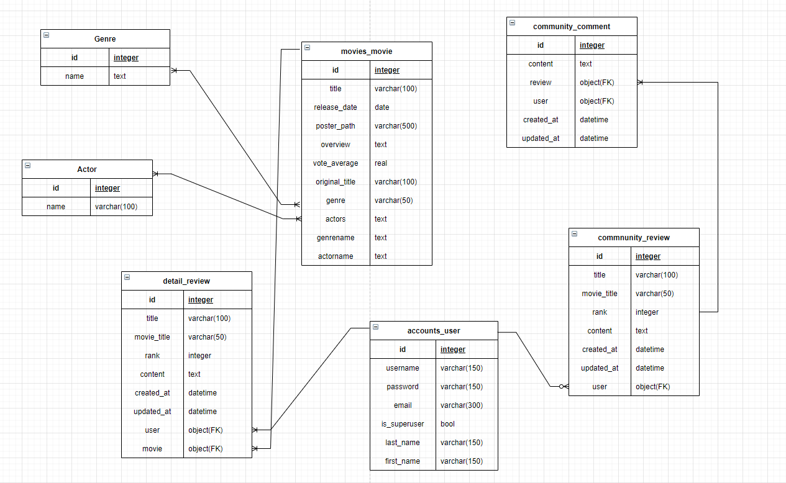


## 6. 필수 기능에 대한 설명

##### A. 관리자 뷰

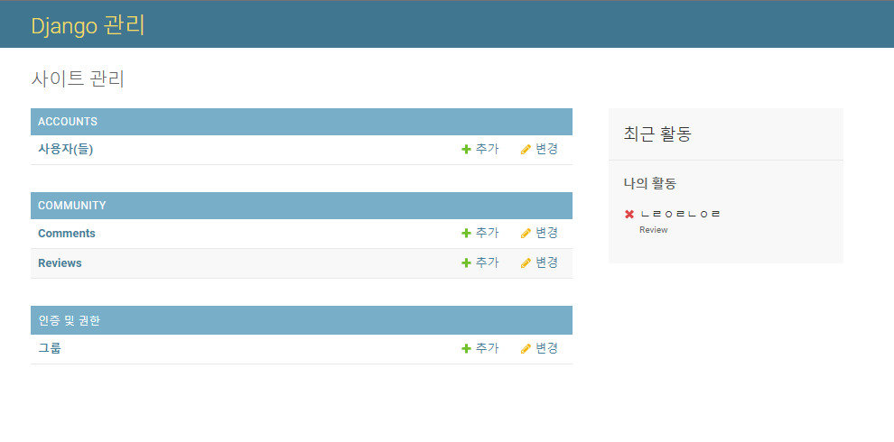

```python
# accounts/admin.py
from django.contrib import admin
from django.contrib.auth.admin import UserAdmin
from .models import User

admin.site.register(User, UserAdmin)
```

> django admin 기능을 이용해 관리자 페이지 구현


##### B. 영화 정보

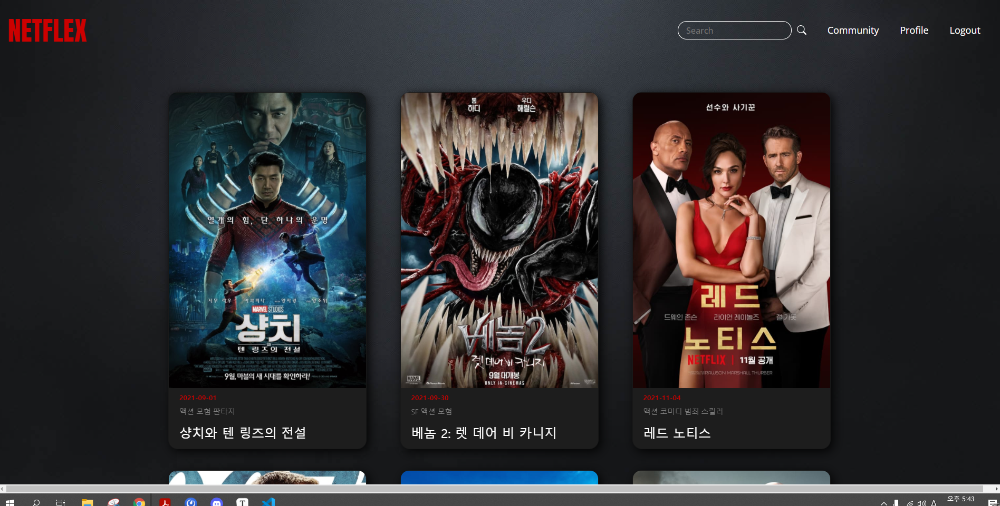

> Home에서 DB에 저장된 영화 목록을 모두 카드 형태로 보여준다.
>
> Hover를 사용하여 마우스를 영화목록에 가져다 놓으면 확대가능

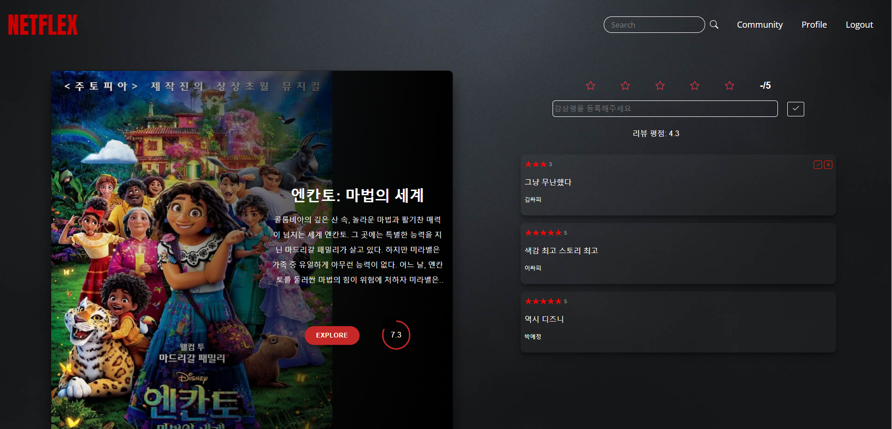

> Home에서 영화 포스터를 누르면 영화 상세페이지로 이동
>
> 영화 줄거리와 평점이 있고 EXPLORE 버튼을 누르면 구글에 해당 영화 검색 페이지로 이동
>
> 우측엔 영화에 대한 평점과 감상평 등록/수정/삭제 기능 구현 (작성자 본인만 수정 및 삭제 가능)

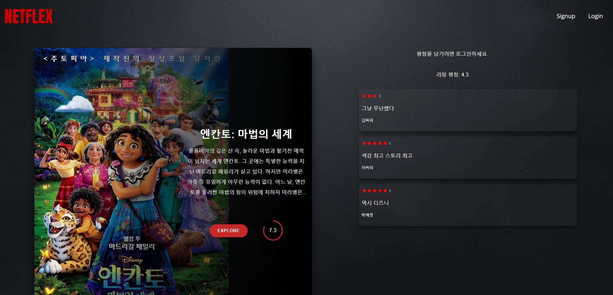

> 로그인 하지 않은 사용자는 상세페이지와 감상평을 보는 것은 가능하도록 구현
>
> 평점을 남기려면 로그인 하라는 메시지를 볼 수 있게 했다.


##### C. 추천 알고리즘

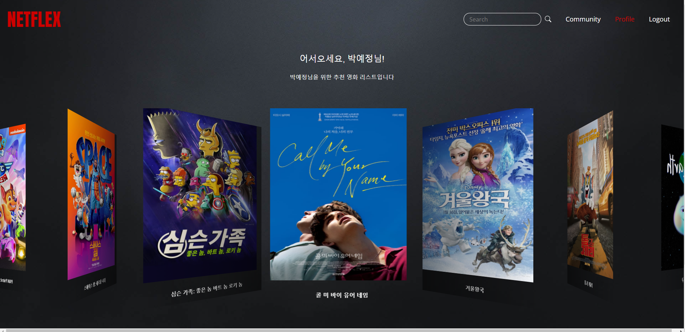

> Profile 메뉴에서 사용자를 위한 영화 추천 목록 표시 (마우스로 좌우 이동 가능)

​	

i. 추천 알고리즘 1

```python
@api_view(['GET'])
@permission_classes([AllowAny])
def recommend(request) :
    movielist = {}
    reviewcount = detailReview.objects.filter(Q(rank='4') | Q(rank='5')).values('movie_id').distinct().count()
    review = detailReview.objects.filter(Q(rank='4') | Q(rank='5')).values('movie_id').distinct()
    print(review[0])
    for i in range(reviewcount) :
        movie = Movie.objects.filter(id=review[i]['movie_id'])
        serializer = MovieSerializer(movie, many=True)
        movielist[i] = serializer.data
    return Response(movielist)
```

> 리뷰를 남긴 사람들 중 별점 4점과 별점 5점을 남긴 사람들만이 있는 영화들을 가져와서 추천한다.


ii. 추천 알고리즘 2

```python
@api_view(['GET'])    
@permission_classes([AllowAny])
def recommend2(request, user_pk) :
    review = detailReview.objects.filter(~Q(user_id=user_pk),rank='5').order_by('?').distinct()[:8]
    serializer = RankSerializer(review,many=True)
```

> 추천 알고리즘 1이 조금 부족하다고 생각해서 알고리즘2를 만들었다.
>
> 알고리즘2는 별점 5점을 남긴 사람들의 영화정보들을 받아와서 랜덤으로 8개 뽑아서 출력한다.
>
> 자신이 평점을 날린 영화의 정보는 남기지 않는다.


##### D. 커뮤니티

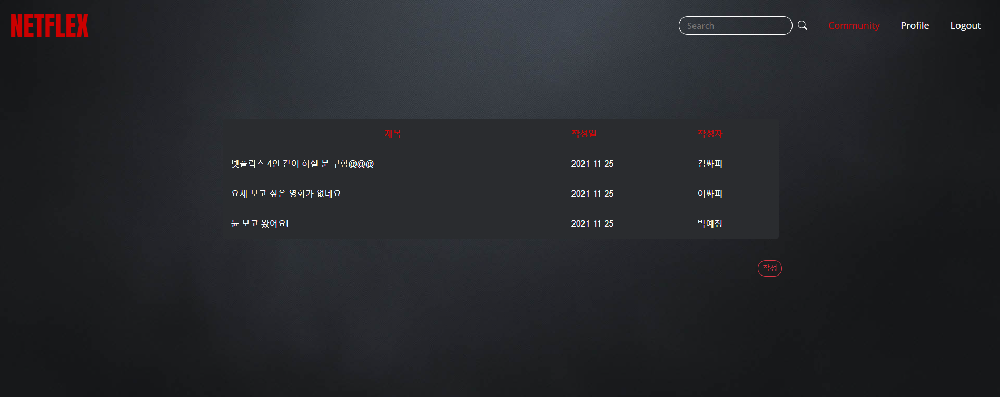

> 영화 커뮤니티
>
> 작성글 제목과 작성일, 작성자를 표시
>
> 글 제목을 눌러 글 상세 페이지로 이동한다.


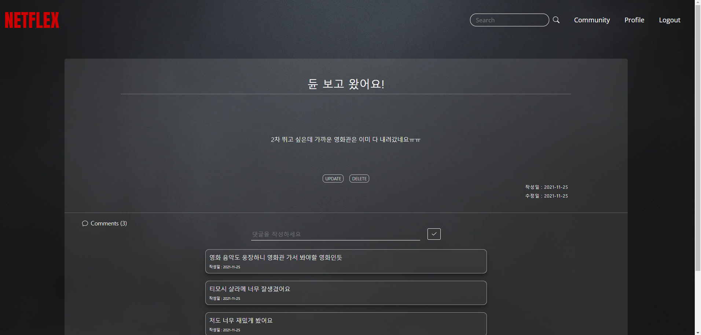

> 글 작성자 본인에게만 update와 delete 버튼이 나타나도록 구현


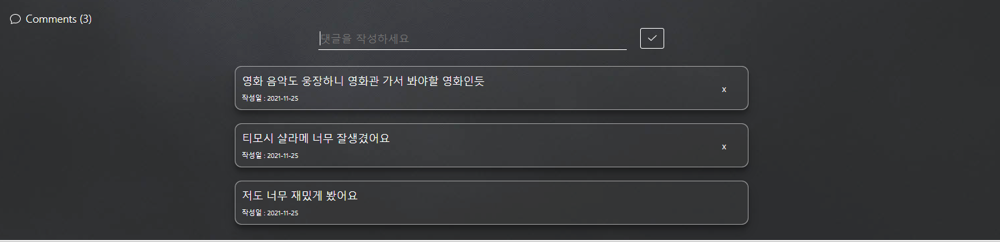

> 댓글 작성자 본인만 댓글 삭제 가능하도록 구현


##### E. 검색 기능

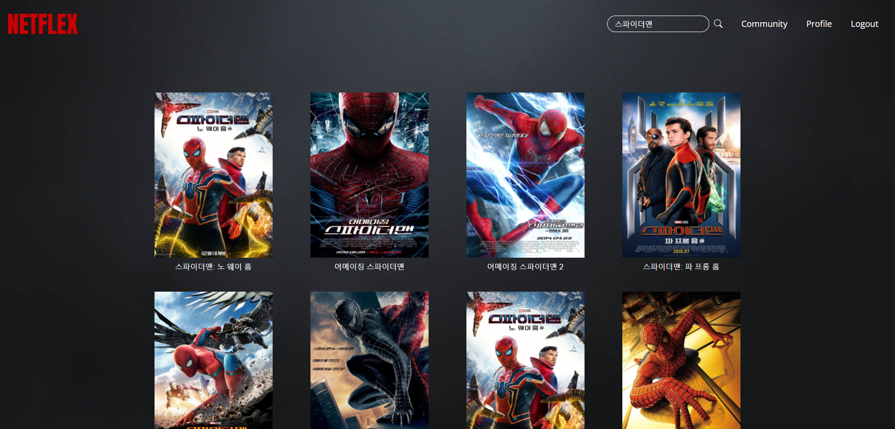

> 검색 키워드가 들어간 영화 제목, 줄거리, 개봉일, 배우, 장르를 검색해 해당하는 영화를
>
> 제목과 함께 포스터를 화면에 출력
>
> 포스터를 클릭하면 영화 상세페이지로 갈 수 있도록 구현

```python
# views/Search.vue

computed: {
    updateResult: function() {
      let res = []
      for (const movie of this.movies){
        if (movie.title.includes(this.$route.query.searchKeyword)){
          res.push(movie)
        } else if (movie.overview.includes(this.$route.query.searchKeyword)){
          res.push(movie)
        } else if (movie.release_date.includes(this.$route.query.searchKeyword)){
          res.push(movie)
        } else if (movie.actorname.includes(this.$route.query.searchKeyword)){
          res.push(movie)
        } else if (movie.genrename.includes(this.$route.query.searchKeyword)){
          res.push(movie)
        }
      }
      return res
    },
```


##### F. 기타

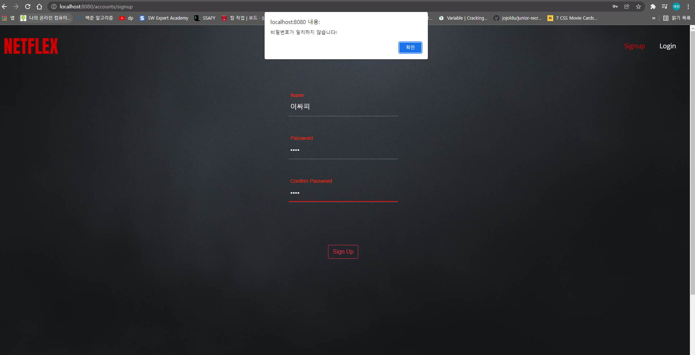

> 회원가입 시 비밀번호와 비밀번호 확인이 일치하지 않으면 Alert 표시


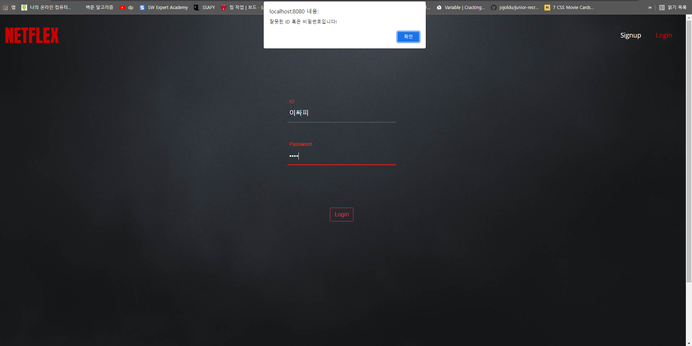

> 로그인 시 ID나 비밀번호를 틀리면 Alert 표시


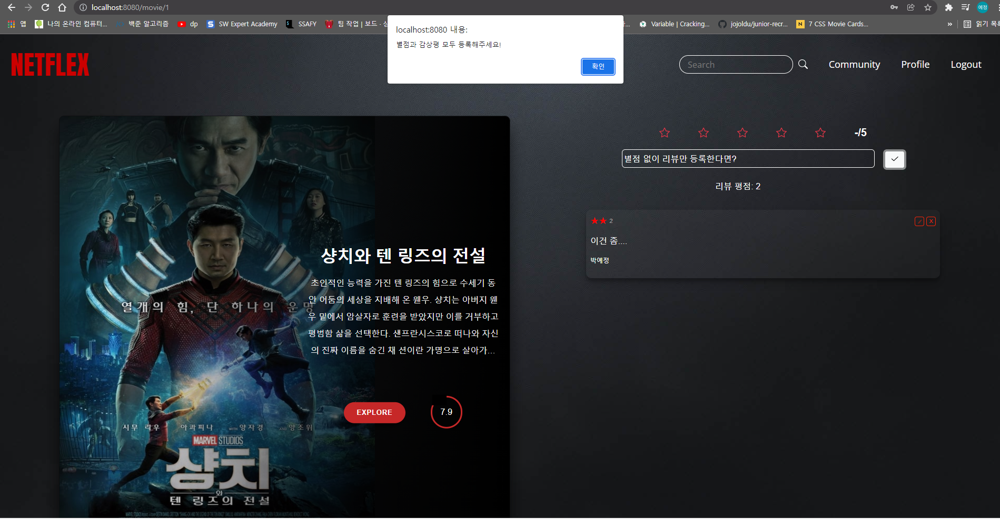

> 영화 상세페이지에서 별점과 감상평 등록 시 감상평을 적지 않으면 Alert 표시


## 7. 기타(느낀점)


박예정 👩‍💻

```
- 약 일주일 간 프로젝트를 하면서 전체적인 프로그래밍 실력이 많이 향상된 느낌이다.
특히 서버와 클라이언트가 어떻게 데이터를 주고 받는지 명확하게 알 수 있었다.
또 무엇을 모르는지 정확하게 알 수 있었고 검색하고 답을 찾아내는 능력도 향상했다.
구현하고 싶었지만 시간이 부족하고 능력이 부족해서 만들지 못한 추가 기능들이 아쉬운 부분이다.
페어가 내가 잘 하지 못하는 django를 맡아서 척척 해주었기 때문에 마음 놓고 vue를 열심히 할 수 있었다.
그래도 목표했던 기능들은 모두 만들었고, 어떻게 데이터가 흐르고 기능들이 동작해야
사용자 측면에서 더 사이트 이용이 원활해질지 충분히 고민할 수 있었다는 점에서
1학기의 마무리로 많이 공부할 수 있고 만족스러운 프로젝트였다.
```


이현석 👨‍💻

```
처음 프로젝트를 할때에는 vue와 django를 결합하는 과정이 매우 힘들어서 한 이틀정도를 
BackEnd기능과 Django에서 Vue에게 어떻게 정보를 주는지 공부했던 것 같다.
그리고 BackEnd와 FrontEnd를 따로 구현해서 Merge하는 과정에서 애로사항이 있었으나 서로가 프로젝트하는동안 최선을 다해서 쉽게 해결 할 수 있었던 것 같다.
이러한 노력 덕분에 이번 프로젝트에서 어떻게 Back에서 Front로 정보를 주는지 알 수 있었다.
또 아쉬운점 하나는 내가 영화 추천 알고리즘을 맡게 되어서 잘하려고 노력했는데
영화 추천 알고리즘도 나름 생각을 해서 좋은 추천알고리즘을 만들려고 노력했는데 그렇게 하지 못한게 아쉬웠다
그리고 영화 추천 알고리즘을 찾으면서 Cos Pibot 알고리즘등 다양한 알고리즘이 있는것을 알게 되었고 다음에 프로젝트를 하면 다양한 알고리즘을 찾아서 다양하게 부여해보고 싶다.
이번 프로젝트를 통해 내가 어떤 것을 알고 어떤 것을 모르는지 알게 되었고 모던하고 예쁜 영화 프로젝트를 만든 것 같아서 좋았다. 다음 프로젝트에는 더 잘 할 수 있도록 노력할 것이고 더 잘 만들고 싶다.
그리고 혼자했으면 힘들어서 포기할 순간도 있었는데 같이 해서 더 열심히 할 수 있었고
페어프로그래밍 하는 일주일동안 프로젝트하면서 지치지 않고 열심히 해준 조원에게 고마웠다.
```


